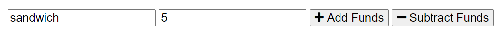
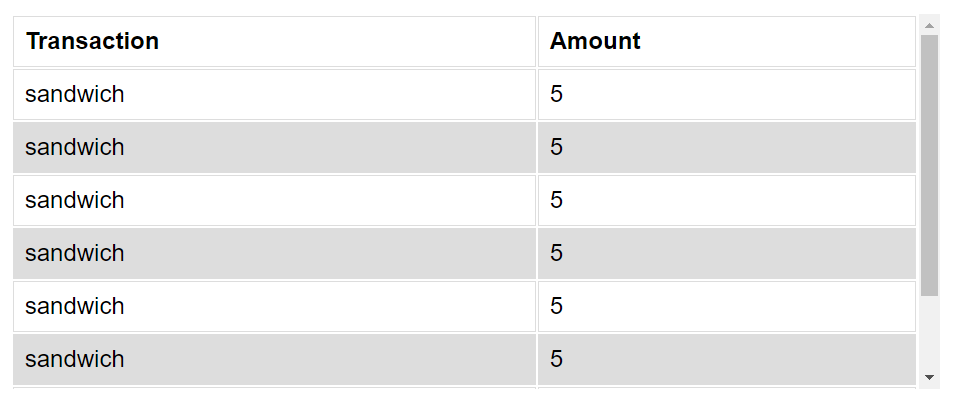
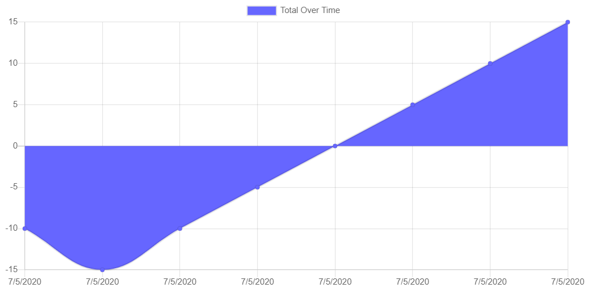

# budgetTracker

## What is the app

* This is an application is made for on the go travelers.

* The user is able to keep track of their financial transactions and maintain their budget on the go.

* Many travelers do not always have access to the internet. With this application the user can keep track of their budget while offline. The next time the user is able to access the internet all of the information they have entered will update their budget.

## How it works

* At the top of the application the user is able to see their total budget, which is the total of all of the entered transactions.

* The user is able to enter the transactions by providing a breif desrcription, followed by the dollar amount. Lastly the user enters if the funds should be added to their budget or subtracted from the budget.

* All of the users transactions are saved to a list and displayed to the user so past transactions can be viewed anytime.

* At the bottom of the application the user is able to see a chart which shows them their budget total over time.

* This is a great application for any travler who will be going into remote areas and will not have access to internet connection consistantly.